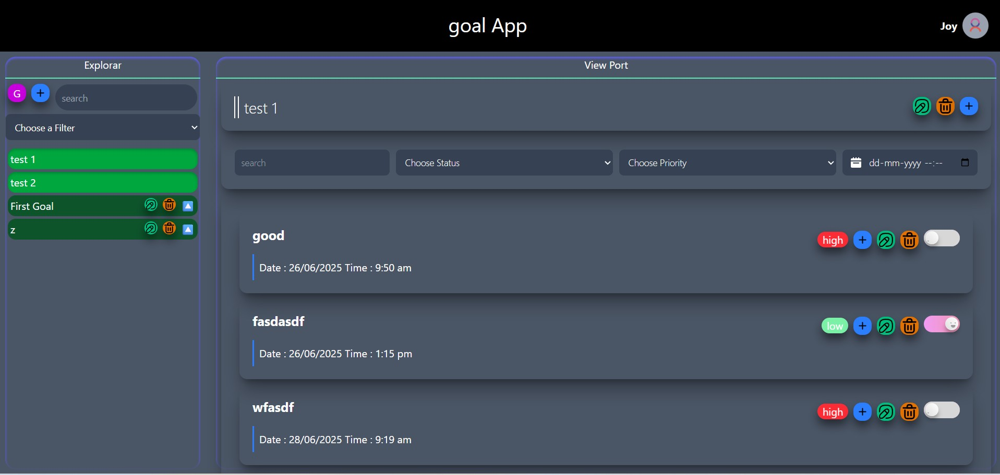
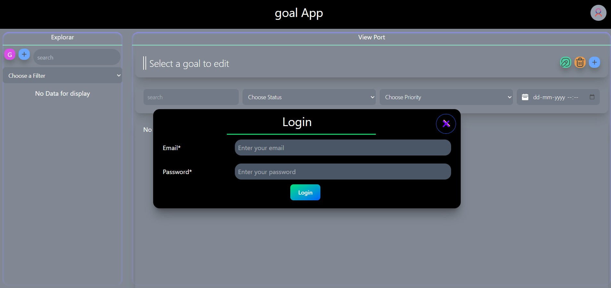
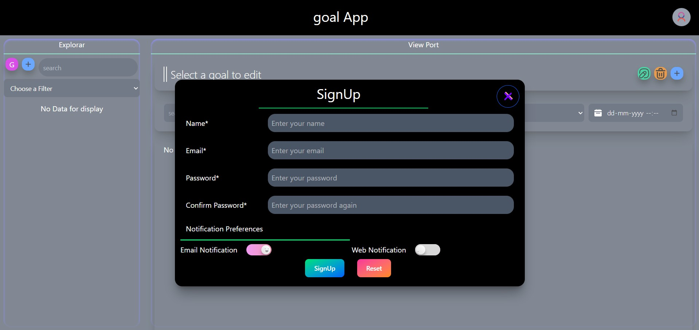

# 🎯 GoalManager

**GoalManager** is a full-stack web application built to help individuals and teams effectively manage their personal or group goals. It supports real-time tracking, scheduling, and notifications to ensure consistent progress and timely completion of tasks.

---

## 📸 Preview

| Home Page | Login Page | Signup Page |
|-----------|----------------|--------------------|
|  |  |  |

---

## 🚀 Features

- 🔐 **Authentication** – Secure login system with user session handling.
- 👥 **User Roles** – Supports personal and group goals.
- 📝 **Goal Management** – Create, update, and delete goals.
- 📅 **Due Date Reminders** – Scheduler and notifications based on deadlines.
- 🛎️ **Web & Email Notifications** – Alert users about upcoming or overdue goals.


---

## 🛠️ Tech Stack

**Frontend**:
- React.js
- TypeScript
- Tailwind CSS

**Backend**:
- Node.js
- Express.js
- MongoDB (Mongoose)
- Node Schedule
- JWT Authentication

---

## 🧪 Run Locally

### Prerequisites

- Node.js ≥ 16
- MongoDB

### Clone and Install

```bash
git clone https://github.com/JoySarkar07/GoalManager.git
cd GoalManager

# Install backend dependencies
cd backend
npm install

# Install frontend dependencies
cd ../frontend
npm install
